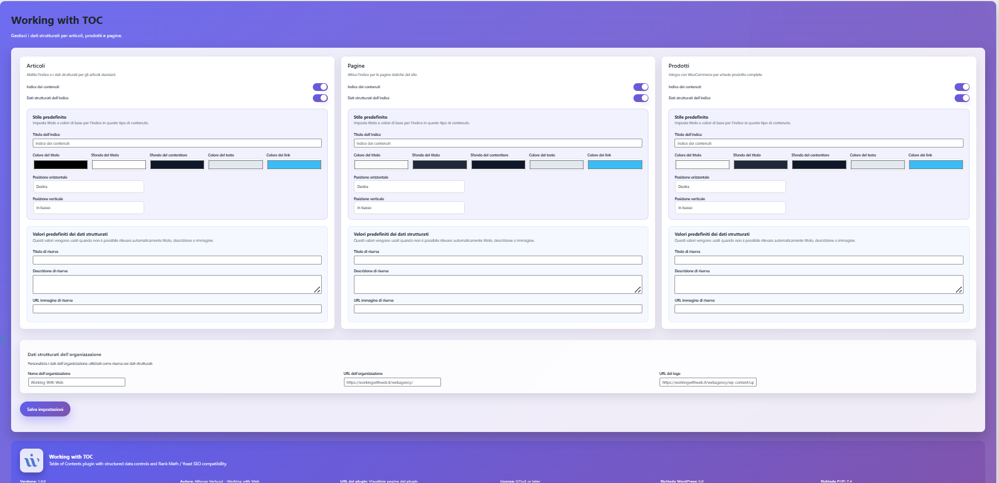
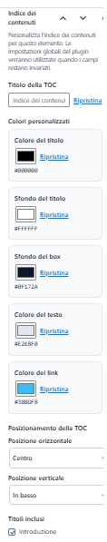

# Working with TOC

## Table of Contents
- [Overview](#overview)
- [Key Features](#key-features)
- [Plugin Structure](#plugin-structure)
- [Backend Settings](#backend-settings)
- [Frontend Functionality](#frontend-functionality)
- [SEO Compatibility](#seo-compatibility)
- [Logging and Debugging](#logging-and-debugging)
- [Quick Start Guide](#quick-start-guide)
- [Multisite Support](#multisite-support)

## Overview

**Working with TOC** is a WordPress plugin designed to automatically build a polished, mobile-friendly table of contents (TOC) for posts, pages, and products. The project demonstrates a file structure that follows WordPress conventions (`includes/`, `admin/`, `frontend/`, `assets/`) and ships utilities for generating structured data recognized by Rank Math and Yoast SEO.
All settings are stored using core WordPress options and post meta, avoiding custom database tables or bespoke version-tracking records.

## Key Features

- Sticky accordion TOC pinned to the bottom of the viewport with a modern, touch-ready design.
- Automatic anchor ID generation for `<h2>-<h6>` headings with links kept in sync across the TOC.
- Custom admin page with toggles to enable the TOC and structured data for posts, pages, and WooCommerce products.
- JSON-LD `ItemList` output compatible with Rank Math and Yoast SEO schema graphs.
- Comprehensive WooCommerce product metadata including GTIN/MPN identifiers, reviews, shipping details, and Open Graph fallbacks.
- Conditional logging keyed off the `WP_DEBUG` flag so production sites stay clean.

## Screenshots






## Plugin Structure

```
working-with-toc/
├── working-with-toc.php
├── assets/
│   ├── css/
│   │   ├── admin.css
│   │   └── frontend.css
│   └── js/
│       ├── admin.js
│       └── frontend.js
├── includes/
│   ├── admin/
│   │   └── class-admin-page.php
│   ├── frontend/
│   │   └── class-frontend.php
│   ├── structured-data/
│   │   └── class-structured-data-manager.php
│   ├── class-autoloader.php
│   ├── class-heading-parser.php
│   ├── class-logger.php
│   ├── class-plugin.php
│   └── class-settings.php
└── README.md
```

> **Maintenance note:** Legacy root-level loaders `class-toc-json.php` and `class-toc-product-json.php` were removed because the
> PSR-4 autoloader now serves the modern classes from the `includes/` directory.

## Backend Settings

The admin menu gains a **Working with TOC** screen with three cards dedicated to each content type. Every card provides a modern toggle to enable or disable the TOC and the related structured data. The layout leans on gradients, soft shadows, and micro animations to deliver a premium feel.

### Custom capability for the settings page

The plugin registers the custom capability `manage_working_with_toc` and automatically assigns it to administrators. You can adjust it through the `working_with_toc_admin_capability` filter. For example, to grant access to editors add the following to your theme or plugin:

```php
add_filter( 'working_with_toc_admin_capability', function ( $capability ) {
    return 'edit_others_posts';
} );
```

This makes the **Working with TOC** page available to any user with the `edit_others_posts` capability (including editors) while preserving the original behavior for other roles.

## Frontend Functionality

The TOC appears in an accordion anchored to the bottom edge of the viewport. Visitors can open or collapse it instantly; when expanded, the content scrolls inside a slide-up panel with dynamic highlighting powered by `IntersectionObserver`.

## SEO Compatibility

- **Rank Math** – the plugin registers itself among supported TOCs, preventing the “No TOC plugin installed” warning.
- **Yoast SEO** – structured data is injected into the existing schema graph through the `wpseo_schema_graph` filter without collisions.
- **Schema.org** – an `ItemList` node is generated with links that match the heading anchors created in the markup.

## Logging and Debugging

Core operations (initialization, saving settings, rendering schema) are routed to `error_log` when `WP_DEBUG` is `true`, delivering actionable context without polluting production.

## Quick Start Guide

1. Copy the plugin folder into `wp-content/plugins/` and activate it in WordPress.
2. Visit **Settings → Working with TOC** to decide where the TOC and structured data should load.
3. Edit or create a post/product: the plugin automatically appends the sticky accordion TOC to the bottom of the page.
4. Confirm Rank Math or Yoast SEO recognizes the TOC and structured data in their analyses.

## Multisite Support

The plugin has been validated in a WordPress multisite (subdirectory mode) with three sites, focusing on the following scenarios:

### Multisite QA

- **Per-site activation** – activating locally adds the dedicated capability via `Plugin::ensure_capability()` and exposes the **Settings → Working with TOC** page. Each site persists its options in the `wwt_toc_settings` entry because the plugin uses `get_option()` / `update_option()` (no `get_site_option()`), so preferences stay isolated per blog.【F:includes/class-plugin.php†L39-L92】【F:includes/class-settings.php†L69-L113】
- **Network Activate** – enabling it from the Network Admin dashboard runs the same bootstrap on every site and ensures administrators automatically receive the `manage_working_with_toc` capability, so the settings page is available everywhere without custom roles.【F:includes/class-plugin.php†L61-L92】
- **Roles and capabilities** – site administrators inherit the capability because `ensure_capability()` loops through every role with `manage_options`. You can verify it with `wp cap list administrator` or any network role editor.【F:includes/class-plugin.php†L68-L92】
- **Classic and block editors** – the metabox registered in `includes/admin/class-meta-box.php` loads on both `post.php` and `post-new.php`, enqueueing `admin.css` and `admin.js`. Preferences are saved in the `_wwt_toc_meta` entry with fallbacks per post type, so each site keeps its preferred layout and colors.【F:includes/admin/class-meta-box.php†L33-L198】【F:includes/admin/class-meta-box.php†L212-L311】
- **Frontend** – on any site, when the TOC is enabled for a content type, `Frontend::enqueue_assets()` registers `assets/css/frontend.css` and `assets/js/frontend.js`, while `Frontend::inject_toc()` renders the markup with site- and post-level preferences. Visiting sample articles on each blog reveals the accordion TOC rendered with the correct styling.【F:includes/frontend/class-frontend.php†L33-L130】【F:includes/frontend/class-frontend.php†L131-L220】

These checks ensure the multisite compatibility claim is backed by concrete, repeatable verification steps.
