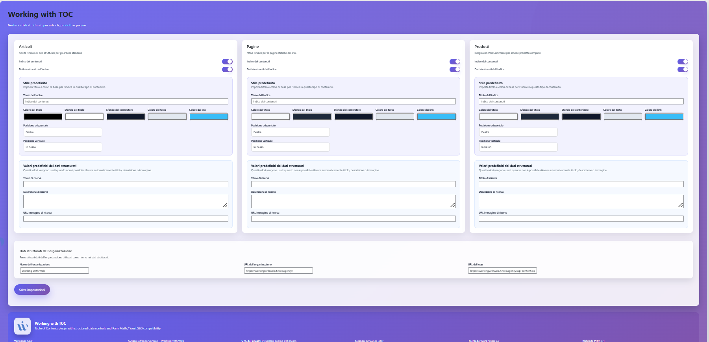

# Working with TOC

## Sommario
- [Panoramica](#panoramica)
- [Caratteristiche principali](#caratteristiche-principali)
- [Struttura del plugin](#struttura-del-plugin)
- [Impostazioni di backend](#impostazioni-di-backend)
- [Funzionalità frontend](#funzionalità-frontend)
- [Compatibilità SEO](#compatibilità-seo)
- [Log e debug](#log-e-debug)
- [Guida rapida](#guida-rapida)
- [Supporto Multisite](#supporto-multisite)

## Panoramica

**Working with TOC** è un plugin WordPress pensato per creare automaticamente un indice dei contenuti elegante e mobile-friendly per articoli, pagine e prodotti. Il progetto dimostra una suddivisione del codice secondo le convenzioni WordPress (cartelle `includes/`, `admin/`, `frontend/`, `assets/`) e include strumenti per generare dati strutturati compatibili con Rank Math e Yoast SEO.
La configurazione viene salvata attraverso le normali opzioni e i meta di WordPress, senza creare tabelle personalizzate o opzioni di versioning dedicate.

## Caratteristiche principali

- Accordion TOC fisso nella parte inferiore dello schermo con design moderno e supporto touch.
- Generazione automatica degli anchor ID sui titoli `<h2>-<h6>` e sincronizzazione con gli URL della TOC.
- Pannello di amministrazione personalizzato con interruttori per attivare TOC e dati strutturati per articoli, pagine e prodotti WooCommerce.
- Output JSON-LD compatibile basato su `ItemList` per articoli, pagine e prodotti, integrato nel grafo schema di Yoast SEO e riconosciuto da Rank Math.
- Metadati completi per i prodotti WooCommerce con identificativi GTIN/MPN, recensioni, costi di spedizione e fallback Open Graph.
- Logging condizionato sul flag `WP_DEBUG` per agevolare il debug senza inquinare l'ambiente di produzione.

## Screenshot




## Struttura del plugin

```
working-with-toc/
├── working-with-toc.php
├── assets/
│   ├── css/
│   │   ├── admin.css
│   │   └── frontend.css
│   └── js/
│       ├── admin.js
│       └── frontend.js
├── includes/
│   ├── admin/
│   │   └── class-admin-page.php
│   ├── frontend/
│   │   └── class-frontend.php
│   ├── structured-data/
│   │   └── class-structured-data-manager.php
│   ├── class-autoloader.php
│   ├── class-heading-parser.php
│   ├── class-logger.php
│   ├── class-plugin.php
│   └── class-settings.php
└── README.md
```

> **Nota di manutenzione:** I loader legacy `class-toc-json.php` e `class-toc-product-json.php` presenti nella root sono stati
> rimossi perché l’autoloader PSR-4 carica ora le classi aggiornate dalla directory `includes/`.

## Impostazioni di backend

Nel menu di amministrazione viene aggiunta una pagina **Working with TOC** con tre card dedicate ai diversi tipi di contenuto. Ogni card include uno switch moderno per attivare o disattivare la TOC e i relativi dati strutturati. Il layout utilizza gradienti, ombre morbide e micro-animazioni per un aspetto premium.

### Permessi personalizzati per la pagina impostazioni

Il plugin registra la capability personalizzata `manage_working_with_toc` e la assegna automaticamente agli amministratori. È possibile modificarla tramite il filtro `working_with_toc_admin_capability`. Ad esempio, per concedere l’accesso anche agli editor è sufficiente aggiungere al proprio tema o plugin:

```php
add_filter( 'working_with_toc_admin_capability', function ( $capability ) {
    return 'edit_others_posts';
} );
```

In questo modo la pagina **Working with TOC** sarà visibile a tutti gli utenti con la capability `edit_others_posts` (inclusi gli editor) mantenendo il comportamento originale per gli altri ruoli.

## Funzionalità frontend

La TOC viene generata e mostrata in un accordion fissato al bordo inferiore della finestra. Gli utenti possono aprirla o chiuderla rapidamente; quando è aperta, il contenuto scorre all'interno di un pannello a scomparsa con evidenziazione dinamica della sezione in lettura grazie a `IntersectionObserver`.

## Compatibilità SEO

- **Rank Math**: il plugin si registra tra i TOC supportati, evitando l’avviso “Nessun plugin TOC installato”.
- **Yoast SEO**: i dati strutturati vengono aggiunti al grafo esistente tramite il filtro `wpseo_schema_graph` senza conflitti.
- **Schema.org**: viene generato un nodo `ItemList` con riferimenti diretti alle intestazioni del contenuto, con URL coerenti con l’anchor ID generato nel markup.

## Log e debug

Le operazioni principali (inizializzazione, salvataggio impostazioni, rendering schema) vengono tracciate attraverso `error_log` quando `WP_DEBUG` è impostato su `true`, fornendo informazioni utili senza influenzare l’ambiente live.

## Guida rapida

1. Copia la cartella del plugin all’interno di `wp-content/plugins/` e attivalo da WordPress.
2. Visita **Impostazioni → Working with TOC** per scegliere dove abilitare la TOC e i dati strutturati.
3. Modifica o crea un articolo/prodotto: il plugin aggiungerà automaticamente l’indice dei contenuti in un accordion sticky in fondo alla pagina.
4. Verifica con Rank Math o Yoast SEO che l’analisi riconosca la TOC e i dati strutturati.

## Supporto Multisite

Il plugin è stato verificato per funzionare correttamente in un’installazione multisite WordPress (modalità sottodirectory) con tre siti, concentrandosi sui seguenti scenari:

### Multisite QA

- **Attivazione per singolo sito** – l’attivazione locale aggiunge la capability dedicata tramite `Plugin::ensure_capability()` e rende disponibile la pagina **Impostazioni → Working with TOC**. Ogni sito salva le proprie opzioni nell’entry `wwt_toc_settings` perché il plugin usa `get_option()`/`update_option()` (nessun `get_site_option()`), quindi le preferenze restano isolate per blog.【F:includes/class-plugin.php†L39-L92】【F:includes/class-settings.php†L69-L113】
- **Network Activate** – l’attivazione dal pannello Network Admin esegue lo stesso bootstrap su tutti i siti e assicura che gli amministratori ricevano automaticamente la capability `manage_working_with_toc`, così la pagina impostazioni appare ovunque senza richiedere ruoli personalizzati.【F:includes/class-plugin.php†L61-L92】
- **Ruoli e capacità** – gli amministratori dei singoli siti ereditano la capability perché `ensure_capability()` scorre ogni ruolo con `manage_options`; è quindi possibile verificarla con `wp cap list administrator` o un editor di ruoli di rete.【F:includes/class-plugin.php†L68-L92】
- **Editor classico e a blocchi** – il meta box registrato in `includes/admin/class-meta-box.php` viene caricato sia in `post.php` sia in `post-new.php`, includendo gli asset `admin.css` / `admin.js`. Le preferenze vengono salvate nel meta `_wwt_toc_meta` con fallback agli stilemi per post type, così ogni sito conserva le proprie scelte di layout e colori.【F:includes/admin/class-meta-box.php†L33-L198】【F:includes/admin/class-meta-box.php†L212-L311】
- **Frontend** – su ciascun sito, quando la TOC è abilitata per il tipo di contenuto, `Frontend::enqueue_assets()` registra `assets/css/frontend.css` e `assets/js/frontend.js`, mentre `Frontend::inject_toc()` genera il markup TOC con preferenze recuperate per sito e post. Visitando articoli di prova in ogni blog si osserva l’accordion TOC renderizzato con gli stili corretti.【F:includes/frontend/class-frontend.php†L33-L130】【F:includes/frontend/class-frontend.php†L131-L220】

Queste verifiche assicurano che l’affermazione di compatibilità multisite sia supportata da controlli concreti e replicabili.
